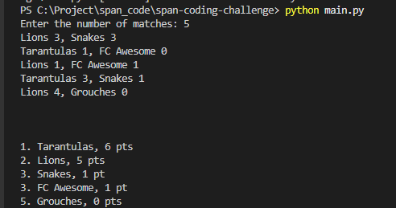
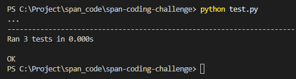

#Problem Statement & Instructions 

## Table of contents
* [General info](#general-info)
* [Technologies](#technologies)
* [Run this project](#setup)
* [Testing](#setup)

## General info
For more details you can view the document from here span-coding-challenge/doc, that where you will see the expected input and output format as well.
	
## Technologies
Project is created with:
* Pyhton 3.9.6 ( but even python2 will work)
	
## Run this project
To run this project, simply run python in terminal:
See the example below: 
```
$ cd ../span-coding-challenge
$ python main.py
```

## Running Tests
Also run in terminal:
See the example below: 
```
$ cd ../span-coding-challenge
$ pip install pytest
$ python test.py
```